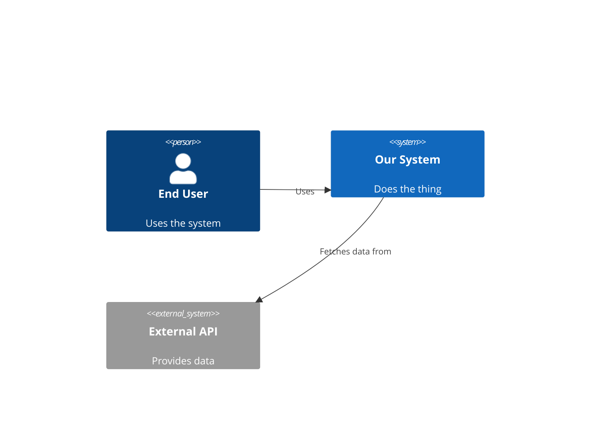

# System Walkthrough Agent: Comprehensive Research Synthesis

**Date:** 2026-02-15
**Purpose:** Evidence-based research to inform the design of a "system-walkthrough" AI agent that analyzes codebases and produces slide-based, narrative-driven walkthroughs covering design, architecture, code, testing, and infrastructure.
**Source documents:** 3 research streams, 144+ independent sources
**Confidence key:** HIGH = 3+ sources | MEDIUM-HIGH = 2-3 sources | MEDIUM = 1-2 sources + interpretation

---

## Table of Contents

1. [Problem Statement and Motivation](#1-problem-statement-and-motivation)
2. [How Developers Understand Code: Cognitive Foundations](#2-how-developers-understand-code-cognitive-foundations)
3. [What the Agent Must Analyze](#3-what-the-agent-must-analyze)
4. [How to Structure the Output](#4-how-to-structure-the-output)
5. [The Narrative Layer: Telling the System's Story](#5-the-narrative-layer-telling-the-systems-story)
6. [Slide Generation: Format and Tooling](#6-slide-generation-format-and-tooling)
7. [Validating AI-Generated Code: The Audit Dimension](#7-validating-ai-generated-code-the-audit-dimension)
8. [Proposed Agent Architecture](#8-proposed-agent-architecture)
9. [Proposed Slide Deck Structure](#9-proposed-slide-deck-structure)
10. [Tools and Data Sources](#10-tools-and-data-sources)
11. [Key Research Findings Summary](#11-key-research-findings-summary)
12. [Knowledge Gaps and Open Questions](#12-knowledge-gaps-and-open-questions)
13. [References](#13-references)

---

## 1. Problem Statement and Motivation

### 1.1 The Comprehension Bottleneck

Developers spend **58% of their time** on program comprehension activities (Code Compass, UC Berkeley, 2024). New developers take **3-6 months** to reach full productivity without structured onboarding, reducible to **8-12 weeks** with good onboarding (industry data, 2025). Document-related challenges alone cause **21.3% productivity loss** (~$20,000/employee/year).

**Confidence: HIGH** (3+ sources)

### 1.2 The AI Code Validation Gap

AI now produces **30-50% of enterprise code** (GitHub Octoverse 2025). Veracode found **45% of AI-generated code fails security tests**. Remediation takes **3x longer** than for human code because teams must first understand the code's purpose before repairing it. No purpose-built framework exists for validating AI-generated code *quality* (as opposed to security).

**Confidence: HIGH** (4+ sources)

### 1.3 Why a System Walkthrough Agent

These two problems converge: teams need to understand both legacy systems and AI-generated code, and they need to do it faster than ever. A system walkthrough agent addresses both by:

1. **Accelerating onboarding** -- providing pre-computed, always-available code explanations
2. **Validating AI output** -- giving developers a structured way to audit what AI agents produced
3. **Preserving institutional knowledge** -- capturing design rationale that otherwise lives only in people's heads

---

## 2. How Developers Understand Code: Cognitive Foundations

### 2.1 The Five Comprehension Models

Research spanning 40+ years converges on five complementary models that an AI agent should support simultaneously:

| Model | Strategy | Key Insight for Agent Design |
|-------|----------|------------------------------|
| **Brooks (1983)** | Top-down, hypothesis-driven | Identify "beacons" (stereotypical patterns) and surface them as anchors. Present hypotheses: "This module appears to [purpose]" |
| **Soloway & Ehrlich (1984)** | Programming plans & discourse rules | Detect common patterns (initialization, accumulator, observer) and flag convention violations |
| **Pennington (1987)** | Bottom-up dual model | Present control-flow ("how it works") first, then domain mapping ("what it means") for unfamiliar code |
| **Letovsky (1987)** | Opportunistic switching | Support entry from any point and navigation in any direction |
| **Von Mayrhauser & Vans (1995)** | Integrated model | All three strategies activate simultaneously in real maintenance; provide parallel views at all abstraction levels |

**Confidence: HIGH** (foundational research, widely validated)

### 2.2 Information Foraging

Developers spend ~50% of comprehension time "foraging" for information across code fragments (Lawrance et al., 2013). The agent should **reduce foraging cost** by pre-linking related artifacts and providing "information scent" cues (summaries, relationship indicators) that help developers decide which paths to explore.

### 2.3 The 44 Questions Developers Ask

Sillito, Murphy, and De Volder (FSE 2006, IEEE TSE 2008) cataloged **44 types of questions** programmers ask during evolution tasks. The walkthrough should proactively answer the most common categories:

- "What is the purpose of this code?"
- "Where is [concept] implemented?"
- "What calls this? What does this call?"
- "What would break if I change this?"
- "How do these components interact?"
- "Why was this designed this way?"

### 2.4 Design Implications

The cognitive research points to five non-negotiable design requirements:

1. **Multi-level abstraction** -- repo > module > file > code levels, navigable in both directions
2. **Hybrid analysis** -- combine deterministic static analysis with LLM-generated explanations
3. **Domain mapping** -- connect code to business concepts, not just technical descriptions
4. **Opportunistic navigation** -- support entry from any point, not just top-down
5. **Rationale recovery** -- surface the "why" behind decisions, not just the "what"

---

## 3. What the Agent Must Analyze

### 3.1 Analysis Layers

Based on the tool and technique research, the agent should execute six analysis layers:

#### Layer 1: Static Structure (fast, no external tools needed)
- **AST parsing** for complexity, coupling, class/function inventory
- **Import/dependency analysis** for module relationships
- **Basic metrics**: LOC, file count, language distribution, duplication
- **Framework/pattern detection**: identify design patterns, frameworks, conventions

#### Layer 2: Behavioral Analysis (requires git history)
- **Hotspot analysis**: complexity x change frequency (the single most actionable metric)
- **Logical coupling**: files that change together (code-maat's `coupling` analysis)
- **Code age**: identifies stale vs. actively maintained areas
- **Knowledge risk**: bus factor per module (single-author files)
- **Contributor patterns**: who owns what, team boundaries

#### Layer 3: Architecture Recovery
- **Dependency graph extraction** and module clustering (Mancoridis/Bunch approach)
- **Layer detection**: identify architectural layers from dependency flow
- **Cycle detection**: circular dependencies between modules
- **Reflexion model**: compare actual dependencies against intended architecture (if ADRs or docs exist)
- **C4 model generation**: auto-generate Context, Container, and Component diagrams

#### Layer 4: Design Decision Recovery
- **ADR detection**: find existing Architecture Decision Records in the repo
- **Commit message analysis**: identify architecture-significant commits
- **Issue tracker cross-reference**: link code changes to documented decisions
- **Inferred decisions**: when no ADRs exist, infer decisions from patterns (e.g., "chose PostgreSQL over MongoDB based on relational schema usage")

#### Layer 5: Test Quality Assessment
- **Test coverage analysis**: line/branch coverage as baseline
- **Assertion density**: assertions per test (AST analysis)
- **Test-to-code ratio**: test file count vs. production file count
- **Mock ratio**: mocks per test (high ratio may indicate design issues)
- **Dead test detection**: tests that cannot reach production code
- **Mutation testing** (optional, compute-intensive): Stryker (JS/TS), PITest (Java), Cosmic Ray (Python)

#### Layer 6: Infrastructure and Configuration
- **CI/CD pipeline analysis**: parse pipeline definitions (GitHub Actions, GitLab CI, Jenkinsfile)
- **Dependency health**: outdated packages, known vulnerabilities
- **Configuration patterns**: environment handling, secret management, deployment topology
- **Containerization**: Dockerfile analysis, compose files, Kubernetes manifests

### 3.2 What Can Be Done Without External Tools

An agent with only filesystem + git access can calculate:

| Metric | Data Source |
|--------|------------|
| Change frequency per file | `git log` |
| Code age (months since last change) | `git log` |
| Logical coupling between files | `git log` (co-change analysis) |
| Contributor analysis / bus factor | `git log` |
| Import/dependency graph | AST parsing or regex on import statements |
| Cyclomatic complexity | AST analysis |
| File/class/function inventory | AST parsing |
| Test-to-code ratio | File naming conventions |
| Assertion density | AST grep for assert/expect patterns |
| Dead code candidates | Orphan files with no importers |
| Framework/pattern detection | File structure + import analysis |
| Dependency health | Package manifest parsing + registry lookup |

### 3.3 External Tools for Deeper Analysis

| Tool | What It Adds | Interface | Language Support |
|------|-------------|-----------|-----------------|
| code-maat | 18 behavioral analyses from git | CLI -> CSV | Any (git-based) |
| dependency-cruiser | Dependency validation + visualization | CLI -> JSON/Mermaid | JS/TS |
| madge | Circular dependency + orphan detection | Node API -> JSON | JS/TS |
| SonarQube | SQALE debt, security, code smells | Docker + REST API | 30+ languages |
| SciTools Understand | Deep metrics + Python API | Python API | 15+ languages |
| ArchUnit / PyTestArch | Architecture compliance testing | JUnit / pytest | Java / Python |

---

## 4. How to Structure the Output

### 4.1 The Combined Framework: Arc42 + C4 + Diataxis + Progressive Disclosure

Research converges on combining four complementary frameworks:

**Arc42** provides the **documentation structure** (12 chapters covering all aspects of a system).
**C4** provides the **zoom hierarchy** (Context > Container > Component > Code).
**Diataxis** provides the **content type discipline** (Tutorial / How-To / Reference / Explanation).
**Progressive Disclosure** provides the **information layering** (Overview > Detail > Deep-Dive).

#### How They Map Together

| Slide Section | Arc42 Chapter | C4 Level | Diataxis Type | Disclosure Tier |
|---------------|---------------|----------|---------------|-----------------|
| Why this system exists | Ch.1: Goals | - | Explanation | Tier 1 |
| System in context | Ch.3: Context | L1: Context | Explanation | Tier 1 |
| Key decisions made | Ch.4: Strategy + Ch.9: Decisions | - | Explanation | Tier 1 |
| Main building blocks | Ch.5: Building Blocks | L2: Container | Reference + Explanation | Tier 1-2 |
| How components interact | Ch.6: Runtime | L3: Component | Explanation | Tier 2 |
| How it's deployed | Ch.7: Deployment | Deployment | Reference | Tier 2 |
| Cross-cutting concerns | Ch.8: Concepts | - | Explanation | Tier 2 |
| Test strategy & quality | Ch.10: Quality | - | Reference | Tier 2 |
| Risks and tech debt | Ch.11: Risks | - | Explanation | Tier 2 |
| Key code walkthroughs | - | L4: Code | Tutorial | Tier 3 |
| API/Config reference | - | - | Reference | Tier 3 |
| Glossary | Ch.12: Glossary | - | Reference | Tier 1 |

### 4.2 The Stakeholder-Driven View (Kruchten 4+1 / ISO 42010)

Different audiences need different views of the same system:

| Audience | Primary Views | Skip |
|----------|---------------|------|
| **New developer** | All Tier 1 + selected Tier 2 | Deep code walkthroughs |
| **Architect/Tech Lead** | Decisions, Architecture, Quality, Debt | Basic code walkthroughs |
| **Product/Business** | Goals, Context, Risks | All technical detail |
| **DevOps/SRE** | Deployment, Infrastructure, Quality | Code internals |
| **AI Code Auditor** | All layers, emphasis on decisions + quality | Onboarding tutorials |

The agent should tag each slide with its intended audience so the deck can be filtered.

### 4.3 Cognitive Load Guidelines

Based on Sweller's Cognitive Load Theory and Miller's Law:

1. **Max 7 (+/-2) top-level sections** in the slide deck
2. **Max 7 items per list** -- group into sub-lists if more needed
3. **One concept per slide** -- don't mix explanation with reference
4. **Diagrams before text** -- visual first, then verbal explanation
5. **Worked examples** for every abstract concept (e.g., "here's an actual request flowing through the system")
6. **3 disclosure tiers maximum** -- Overview, Detail, Deep-Dive
7. **Each slide opens with a 1-sentence summary** of what it covers

---

## 5. The Narrative Layer: Telling the System's Story

### 5.1 Why Narrative Matters

Human memory is story-based and retrieval is episodic. Information embedded in narrative is more memorable than isolated facts. Architecture decisions framed as conflict/resolution pairs are more comprehensible than flat lists of choices.

### 5.2 The System Story Arc

The walkthrough should follow a narrative structure:

```
1. SETTING     -- What problem does this system solve? Who are the users?
                  What existed before? What constraints apply?

2. CHARACTERS  -- What are the key components? What roles do they play?
                  Why do they exist? (Introduce as "characters with motivations")

3. CONFLICT    -- What technical challenges drove the design?
                  What trade-offs were faced? What constraints shaped decisions?

4. RESOLUTION  -- How does the architecture address the challenges?
                  What decisions were made and why? (ADR format: Context > Decision > Consequences)

5. EPILOGUE    -- What are the known limitations?
                  What technical debt exists? What's the evolution path?
```

### 5.3 Decision Records as Narrative Backbone

Each significant design decision should be presented as a mini-story using the ADR pattern:

- **Context** (the forces at play, the constraints)
- **Decision** (what was chosen)
- **Consequences** (what became easier AND harder)

When ADRs don't exist in the repo, the agent should **infer decisions** from:
- Commit history (architecture-significant changes)
- Dependency choices (why this database? why this framework?)
- Structural patterns (why this layer organization? why these module boundaries?)

These should be clearly labeled as **inferred** vs. documented.

### 5.4 Making the "Why" Organic

The key request is that information should be presented "in an organic way, explaining why certain decisions were made." This means:

- **Don't separate "what" from "why"** -- weave rationale into every section
- **Don't use bullet-point lists of decisions** -- tell the story of each decision in context
- **Connect decisions to each other** -- "Because we chose X for [reason], we then needed Y"
- **Acknowledge trade-offs honestly** -- "This choice optimized for [A] at the cost of [B]"

---

## 6. Slide Generation: Format and Tooling

### 6.1 Recommended Tool: Marp

**Marp** is the strongest candidate for AI-generated slides because:

1. **Pure Markdown input** -- the format AI agents produce most naturally
2. **Headless CLI** with parallel batch conversion (`marp-cli`)
3. **JavaScript API** for programmatic integration
4. **Multiple output formats**: PDF, PPTX, HTML, images
5. **Custom engine support** for post-processing pipelines
6. **Mermaid diagram support** for architecture diagrams

### 6.2 Slide Syntax

```markdown
---
marp: true
theme: default
paginate: true
header: "System Walkthrough: [Project Name]"
---

# System Overview

[1-2 sentence summary of what this system does and why]

---

## The Problem We Solve

[Business context and motivation -- the SETTING of the story]

- Who are the users?
- What pain point does this address?
- What existed before this system?

---

## System Context



[Explanation of the context diagram]
```

### 6.3 Diagram Generation

The agent should generate **Mermaid diagrams** inline in the Markdown:

| Diagram Type | Use Case |
|-------------|----------|
| C4Context | System in its environment |
| C4Container | Main building blocks and their technologies |
| C4Component | Internal structure of a container |
| sequenceDiagram | Key runtime interactions |
| flowchart | Process flows and decision logic |
| graph TD | Dependency relationships |

### 6.4 Alternative: reveal.js via reveal-md

For cases requiring nested navigation (vertical slides for deep-dives), reveal-md provides:
- Horizontal slides for main sections
- Vertical slides for progressive disclosure (drill down on any topic)
- Speaker notes for presenter guidance
- PDF export via DeckTape

---

## 7. Validating AI-Generated Code: The Audit Dimension

### 7.1 Why This Matters for the Walkthrough Agent

When the system being walked through was partially or fully generated by AI agents (Cursor, Copilot, Claude Code, Devin, etc.), the walkthrough serves a dual purpose:

1. **Understanding** -- what does this code do and why?
2. **Validation** -- is this code well-structured, secure, and maintainable?

### 7.2 AI Code Risk Profile

- **45% failure rate** on security tests (Veracode, 100+ LLMs)
- **43% of patches** fix the primary issue but introduce new failures under adverse conditions
- **3x remediation cost** compared to human-written code
- **"Happy path" bias** -- AI code passes automated tests but fails adversarial scenarios

### 7.3 Validation Checklist the Agent Should Apply

When generating a walkthrough for AI-generated code, the agent should flag:

1. **Architectural coherence** -- Do modules have clear boundaries? Are layers respected?
2. **Decision rationale gaps** -- Are there design choices with no apparent rationale?
3. **Test coverage quality** -- Not just coverage %, but assertion density and mutation scores
4. **Dependency patterns** -- Circular dependencies, god modules, inappropriate coupling
5. **Security patterns** -- Input validation, authentication/authorization, secret management
6. **Consistency** -- Do similar problems get solved the same way across the codebase?
7. **Over-engineering signals** -- Unnecessary abstractions, premature optimization, dead code

### 7.4 Presenting Validation Findings in Slides

Validation findings should be woven into the walkthrough, not presented as a separate "audit report." For each section:

- **Architecture slides** should note conformance or violations
- **Code walkthrough slides** should flag quality concerns in context
- **Test slides** should present coverage AND effectiveness metrics
- A final **"Health Assessment" section** should summarize findings with a clear risk profile

---

## 8. Proposed Agent Architecture

### 8.1 Pipeline Overview

```
INPUT                    ANALYSIS                  SYNTHESIS                OUTPUT
─────                    ────────                  ─────────                ──────
Codebase ──┐
            ├──> Layer 1: Static Structure ──┐
Git history ┤                                 │
            ├──> Layer 2: Behavioral Analysis ├──> Narrative     ──> Marp Markdown
README/docs ┤                                 │    Engine             │
            ├──> Layer 3: Architecture Recovery│                      ├──> PDF slides
Config files┤                                 ├──> Slide         ──> ├──> PPTX
            ├──> Layer 4: Decision Recovery   │    Generator          ├──> HTML
CI/CD files ┤                                 │                      └──> Images
            ├──> Layer 5: Test Quality        │
            └──> Layer 6: Infrastructure     ─┘
```

### 8.2 Analysis Phase

The agent performs analysis in dependency order:

1. **Scan** -- inventory all files, detect languages, frameworks, and project structure
2. **Parse** -- extract AST, dependency graphs, and metrics
3. **Mine** -- analyze git history for behavioral patterns
4. **Recover** -- identify architecture, design decisions, and patterns
5. **Assess** -- evaluate test quality, technical debt, and compliance

### 8.3 Synthesis Phase

The synthesis phase transforms raw analysis into narrative:

1. **Classify** -- assign each finding to an Arc42 chapter and Diataxis type
2. **Narrate** -- generate explanatory text using the story arc (Setting > Characters > Conflict > Resolution > Epilogue)
3. **Diagram** -- generate Mermaid diagrams for architecture, dependencies, and flows
4. **Sequence** -- order slides following progressive disclosure (Overview > Detail > Deep-Dive)
5. **Tag** -- mark each slide with audience relevance and disclosure tier

### 8.4 Code Summarization Strategy

Based on research findings (Sun et al., 2025; Dhulshette et al., 2025):

1. **Use simple zero-shot prompts** -- advanced prompting often doesn't outperform simple prompts for code summarization
2. **Summarize hierarchically** -- function > file > module > repo (bottom-up)
3. **Include domain context** in prompts, not just technical details
4. **Cross-reference LLM summaries against static analysis** -- LLMs rely on surface cues (variable names, comments) and can be misled
5. **Use one-shot examples** specific to the project's domain for improved quality

### 8.5 LLM Limitations to Account For

- LLMs rely heavily on surface-level code cues and degrade when names/comments are misleading (arXiv:2504.04372, 2025)
- AI risks making onboarding "shallow" -- developers can generate explanations without deep understanding
- The agent should prioritize **explanation over generation** and include honest uncertainty markers

---

## 9. Proposed Slide Deck Structure

### 9.1 The Seven Sections (respecting Miller's Law)

Based on the research synthesis, the walkthrough deck should have exactly **7 top-level sections**:

```
SECTION 1: THE STORY          (3-5 slides)  -- Tier 1
  "Why this system exists and what it does"
  - Business problem and users
  - System context diagram (C4 L1)
  - Key constraints and goals

SECTION 2: THE ARCHITECTURE    (5-8 slides)  -- Tier 1-2
  "How the system is organized and why"
  - Container diagram (C4 L2) with technology choices
  - Key design decisions (ADR-style: context > decision > consequences)
  - Data flow through the system (sequence diagram)
  - Cross-cutting concerns (auth, logging, error handling)

SECTION 3: THE CODE            (5-10 slides) -- Tier 2
  "What the main code blocks do and how they're organized"
  - Module map with responsibilities
  - Component deep-dives for each major module (C4 L3)
  - Key patterns and conventions used
  - Dependency relationships (with cycle/coupling flags)

SECTION 4: THE QUALITY         (3-5 slides)  -- Tier 2
  "How the system is tested and how healthy the code is"
  - Test strategy overview
  - Coverage AND effectiveness metrics (mutation score if available)
  - Technical debt hotspots (complexity x change frequency)
  - Code health summary

SECTION 5: THE INFRASTRUCTURE  (3-5 slides)  -- Tier 2
  "How the system is built, deployed, and operated"
  - CI/CD pipeline overview
  - Deployment topology (C4 Deployment diagram)
  - Environment and configuration management
  - Monitoring and observability

SECTION 6: THE RISKS           (2-3 slides)  -- Tier 1-2
  "What you should watch out for"
  - Known technical debt and risks
  - Knowledge silos (bus factor analysis)
  - Architectural violations or drift
  - AI-generated code assessment (if applicable)

SECTION 7: GETTING STARTED     (2-3 slides)  -- Tier 1
  "How to start contributing"
  - Development environment setup
  - Key entry points for common tasks
  - Where to find help (docs, people, tools)
  - Suggested first exploration path
```

### 9.2 Slide Count

Total: **23-39 slides** for a comprehensive walkthrough.
A "quick overview" variant could use only Tier 1 slides: **~10-15 slides**.

### 9.3 Each Slide Template

Every slide should follow this structure:

```markdown
---

## [Section] > [Topic]

[1-sentence summary of this slide's key point]

[Diagram or visual element, if applicable]

[2-4 bullet points or short paragraphs of explanation]

[Why this matters / the decision behind it]

<!-- presenter notes: additional context for the presenter -->

---
```

---

## 10. Tools and Data Sources

### 10.1 Core Tools (No External Dependencies)

These require only filesystem + git access:

| Capability | Technique |
|-----------|-----------|
| File inventory and language detection | File extension analysis |
| Dependency graph | Import statement parsing (AST or regex) |
| Complexity metrics | AST analysis (cyclomatic, nesting depth) |
| Change frequency | `git log --numstat` |
| Code age | `git log` per-file last-modified |
| Logical coupling | Co-change analysis from git log |
| Bus factor / knowledge risk | Author analysis from git log |
| Test-to-code ratio | File naming convention matching |
| Assertion density | AST grep for assert/expect |
| Framework detection | Package manifests + import analysis |
| ADR detection | File pattern matching (docs/adr/, architecture/decisions/) |

### 10.2 Optional External Tools

| Tool | Value Added | Install |
|------|-----------|---------|
| code-maat | 18 behavioral analyses, CSV output | Java JAR |
| dependency-cruiser | Dependency validation, Mermaid output | npm |
| madge | Circular deps + dead code detection | npm |
| Marp CLI | Markdown -> PDF/PPTX/HTML slides | npm |
| SonarQube | SQALE debt, security scanning | Docker |
| Stryker | Mutation testing (JS/TS) | npm |

### 10.3 Output Format Chain

```
Analysis results (JSON/structured data)
    |
    v
Narrative synthesis (LLM)
    |
    v
Marp Markdown (with Mermaid diagrams)
    |
    v
marp-cli
    |
    +---> PDF slides
    +---> PPTX slides
    +---> HTML presentation
    +---> PNG/SVG images
```

---

## 11. Key Research Findings Summary

### 11.1 Top 10 Evidence-Based Principles for the Agent

| # | Principle | Source | Confidence |
|---|-----------|--------|------------|
| 1 | Present information at multiple abstraction levels simultaneously | Von Mayrhauser & Vans (1995), Storey (2006) | HIGH |
| 2 | Combine static analysis with LLM reasoning; never rely on LLM alone | Sun et al. (2025), arXiv:2504.04372 | HIGH |
| 3 | Use hierarchical bottom-up summarization (function > file > module > repo) | Dhulshette et al. (2025), Oskooei et al. (2025), Code-Craft (2025) | HIGH |
| 4 | Simple zero-shot prompts often match or outperform advanced prompting | Sun et al. (2025, ICSE), arXiv:2411.02093 | HIGH |
| 5 | Map code to business/domain concepts, not just technical descriptions | Pennington (1987) situation model, Sillito et al. (2006) | HIGH |
| 6 | Frame decisions as conflict/resolution narratives (ADR pattern) | Nygard (2011), Verma (narrative design), Shahbazian (RecovAr) | HIGH |
| 7 | Limit cognitive load: max 7 items per list, 3 disclosure tiers, diagrams before text | Miller (1956), Sweller (1988), Nielsen (1995) | HIGH |
| 8 | Use Marp for slide generation (pure Markdown input, headless CLI, multi-format output) | Tool comparison across 4 frameworks | HIGH |
| 9 | Hotspot analysis (complexity x change frequency) is the most actionable quality metric | Tornhill/CodeScene, code-maat, CMU SEI | HIGH |
| 10 | Tag content by Diataxis type and audience; never mix explanation with reference | Procida (Diataxis), Rozanski & Woods (viewpoints) | HIGH |

### 11.2 What Works (Strong Evidence)

- **Hierarchical code summarization** with LLMs produces useful repository-level understanding
- **Arc42 + C4 combined** covers all documentation needs with clear structure
- **Behavioral analysis from git history** (hotspots, coupling, ownership) reveals more than static analysis alone
- **ADR-style decision documentation** is the most effective way to preserve design rationale
- **Progressive disclosure** (3 tiers) manages cognitive load effectively

### 11.3 What Doesn't Work (Strong Evidence Against)

- **Complex prompt engineering** for code summarization (often performs worse than simple prompts)
- **LLM-only analysis** without static analysis cross-referencing (misled by variable names/comments)
- **Flat documentation** without hierarchy (causes information foraging overhead)
- **Mixing Diataxis types** in a single section (confuses the reader)
- **Coverage-only test metrics** (high coverage with weak assertions gives false confidence)

---

## 12. Knowledge Gaps and Open Questions

### 12.1 Unresolved Research Questions

| Gap | Impact on Agent Design |
|-----|----------------------|
| No controlled studies measuring AI-assisted vs. unassisted codebase comprehension | Cannot quantify expected improvement; must measure empirically |
| Optimal granularity for hierarchical summarization is underspecified | Must experiment with number of levels and aggregation strategy |
| No cross-language architecture recovery with LLMs | Polyglot codebases may need language-specific analysis paths |
| No automated cognitive load assessment for documentation | Must rely on heuristic checklist, not measurement |
| No framework for validating AI-generated code quality (vs. security) | The agent fills this gap but has no established benchmark to compare against |

### 12.2 Design Decisions the Agent Must Make

1. **How many abstraction levels?** Research validates the hierarchy but doesn't specify optimal depth. Proposed: 4 levels (repo > module > file > function), matching C4.

2. **When to infer vs. report uncertainty?** The agent should clearly distinguish documented decisions from inferred ones. Proposed: use "Documented:" and "Inferred:" prefixes.

3. **How to handle large codebases?** Hierarchical summarization helps, but the agent needs a strategy for selecting which modules to deep-dive. Proposed: use hotspot analysis to prioritize.

4. **Slide count vs. depth trade-off?** Miller's Law suggests limits, but comprehensive systems need detail. Proposed: 7 sections with expandable sub-slides, quick-overview variant for Tier 1 only.

5. **Interactive vs. static output?** Marp produces static slides; reveal.js enables nested navigation. Proposed: Marp for default (widest compatibility), reveal.js as optional interactive mode.

---

## 13. References

### Cognitive Foundations
1. Brooks, R. (1983). "Towards a theory of the comprehension of computer programs." *IJMMS*, 18(6).
2. Soloway, E. & Ehrlich, K. (1984). "Empirical Studies of Programming Knowledge." *IEEE TSE*, SE-10(5).
3. Pennington, N. (1987). "Stimulus structures and mental representations." *Cognitive Psychology*, 19.
4. Letovsky, S. (1987). "Cognitive processes in program comprehension." *JSS*, 7(4).
5. Von Mayrhauser, A. & Vans, A.M. (1995). "Program Comprehension During Software Maintenance." *IEEE Computer*.
6. Storey, M.-A. (2006). "Theories, tools and research methods in program comprehension." *SQJ*, 14.
7. Sillito, J. et al. (2006/2008). "Questions Programmers Ask." *FSE-14* / *IEEE TSE*, 34.
8. Lawrance, J. et al. (2013). "An Information Foraging Theory Perspective." *ACM TOSEM*.
9. Miller, G.A. (1956). "The Magical Number Seven." *Psychological Review*, 63.
10. Sweller, J. (1988). "Cognitive Load During Problem Solving." *Cognitive Science*, 12.

### Architecture and Documentation
11. Kruchten, P. (1995). "The 4+1 View Model." *IEEE Software*.
12. Murphy, G.C. et al. (1995/2001). "Software Reflexion Models." *FSE* / *IEEE TSE*, 27.
13. Mancoridis, S. et al. (1999). "Bunch clustering tool." *ICSM'99*.
14. Nygard, M. (2011). "Documenting Architecture Decisions." Cognitect Blog.
15. Arc42 Template, v9.0 (2025). arc42.org.
16. Brown, S. C4 Model. c4model.com.
17. Procida, D. Diataxis Documentation Framework. diataxis.fr.
18. ISO/IEC/IEEE 42010:2022. Architecture Description standard.
19. Rozanski, N. & Woods, E. "Viewpoints and Perspectives."

### Code Summarization and LLMs
20. Sun, W. et al. (2025). "Source Code Summarization in the Era of LLMs." *ICSE 2025*.
21. Dhulshette, N. et al. (2025). "Hierarchical Repository-Level Code Summarization." *LLM4Code/ICSE 2025*.
22. Oskooei, A.R. et al. (2025). "Repository-Level Code Understanding via Hierarchical Summarization." *ICCSA 2025*.
23. Guo, D. et al. (2021). "GraphCodeBERT." *ICLR 2021*.
24. "How Accurately Do LLMs Understand Code?" (2025). arXiv:2504.04372.

### Design Decision Recovery
25. Shahbazian, A. et al. (2018). "Recovering Architectural Design Decisions." *IEEE ICSA*.
26. Jansen, A. et al. (2008). "Documenting after the fact." *JSS*.

### Developer Onboarding
27. "Code Compass." (2024). arXiv:2405.06271.
28. Dagenais, B. et al. (2010). "Moving into a New Software Project Landscape." *ICSE'10*.
29. Steinmacher, I. et al. (2014). "Barriers Faced by Newcomers." *IFIP Advances*.

### Tools and Validation
30. Tornhill, A. code-maat. github.com/adamtornhill/code-maat.
31. dependency-cruiser. github.com/sverweij/dependency-cruiser.
32. Marp. marp.app.
33. ArchUnit. archunit.org.
34. Veracode (2025). "GenAI Code Security Report."
35. AIDev study (2025). arXiv:2602.09185.

### Slide and Presentation Tools
36. Marp CLI. github.com/marp-team/marp-cli.
37. Slidev. sli.dev.
38. reveal.js. revealjs.com.
39. The Good Docs Project. thegooddocsproject.dev.

---

*Research synthesis completed 2026-02-15. Based on 144+ sources across 3 research streams. All confidence ratings reflect source count and cross-reference validation.*
