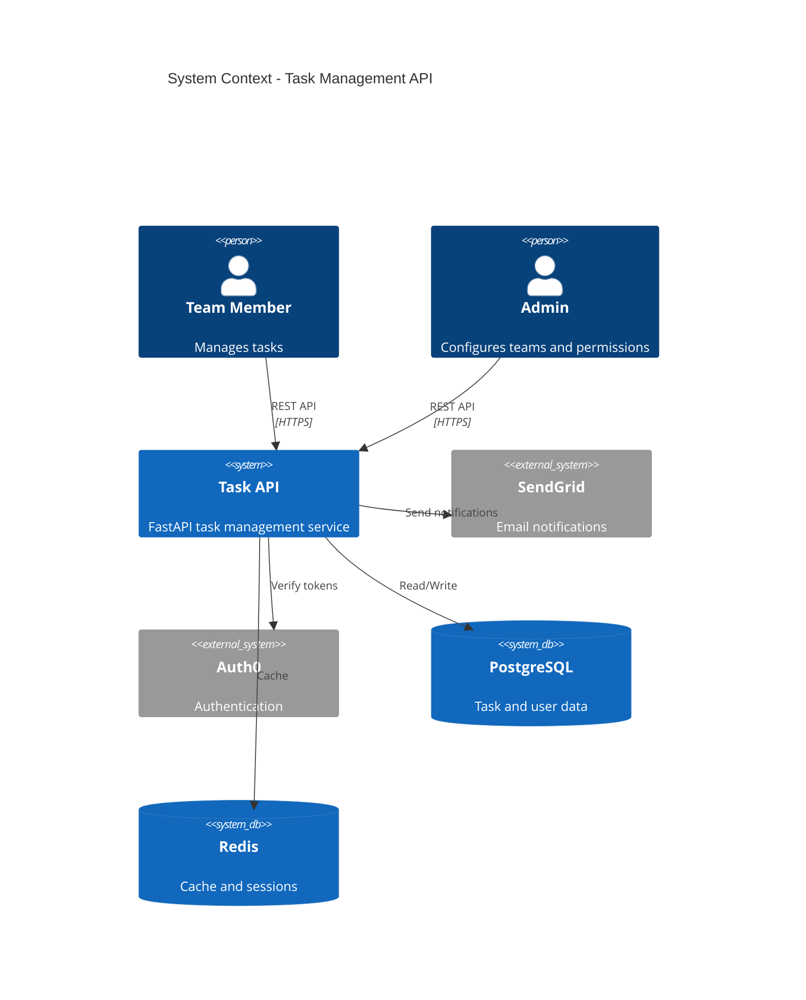
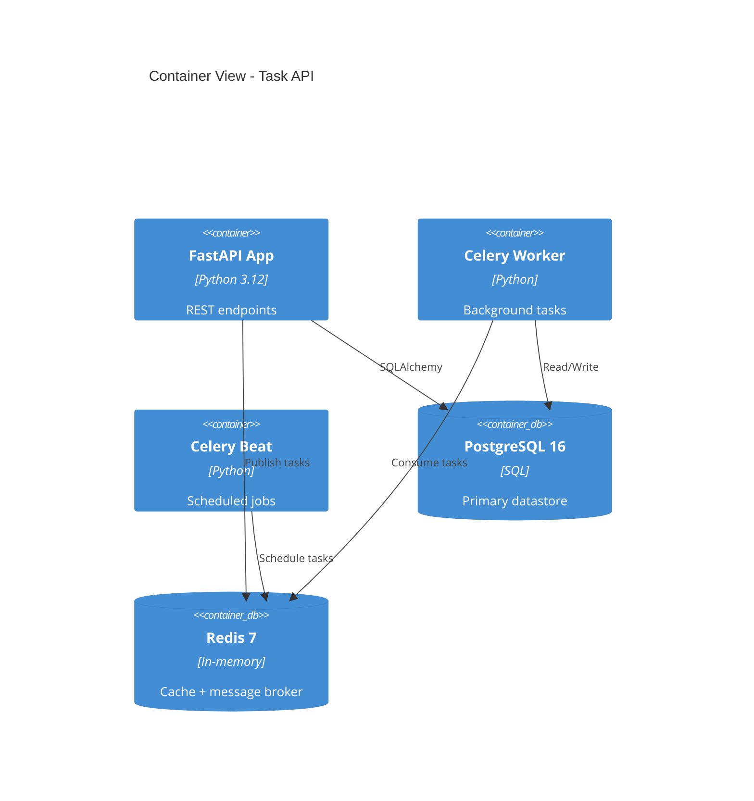
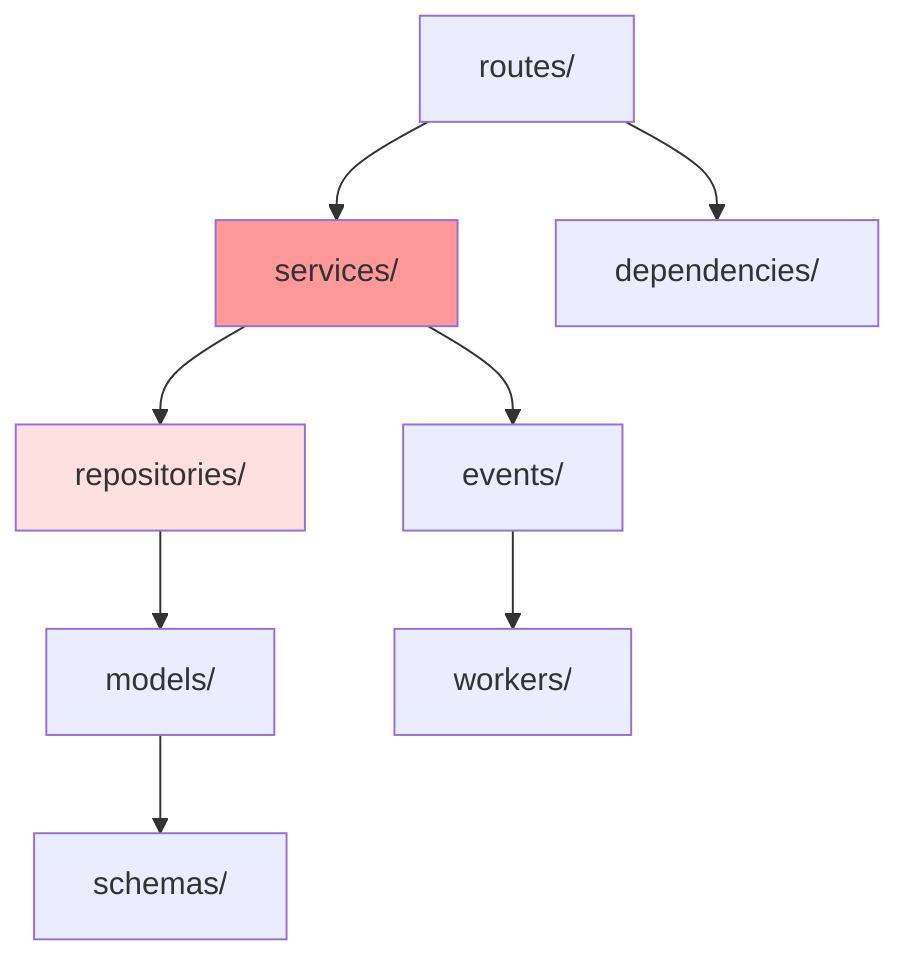
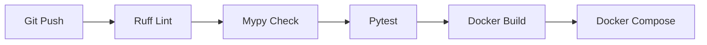

# Task Management API

A FastAPI-based task management service generated by Claude Code

*AI Code Audit Mode enabled — validation findings woven throughout*

<!-- Presenter notes: This codebase was generated in a single agentic session. 200 files, 45 test files, GitHub Actions CI. Analysis reveals several patterns typical of AI-generated code. -->

---

## SECTION 1: THE STORY

---

## The Problem

Teams need a centralized API for managing tasks with assignment, prioritization, and notification capabilities.

- **Users**: Development teams via REST API and a React frontend
- **Generated by**: Claude Code in a single multi-hour session
- **Stack**: Python 3.12, FastAPI, SQLAlchemy, PostgreSQL, Docker

| Metric | Value |
|--------|-------|
| **Files** | 200 (142 production, 45 test, 13 config) |
| **Lines of code** | ~12,000 |
| **Git commits** | 87 (all by AI agent) |
| **Age** | 3 days |

---

## System Context



---

## SECTION 2: THE ARCHITECTURE

---

## Container Overview



---

## Decision: FastAPI + SQLAlchemy

*Inferred — no ADR found*

**Context**: AI agent selected the tech stack for a Python REST API with PostgreSQL.

**Decision**: FastAPI for the web framework, SQLAlchemy 2.0 for ORM, Alembic for migrations.

**Consequences**:
- FastAPI provides automatic OpenAPI docs, type validation, and async support
- SQLAlchemy 2.0 with async sessions enables non-blocking database access
- Alembic migrations are auto-generated from model changes

**Audit note**: This is a reasonable stack choice, but the async SQLAlchemy sessions add complexity that a sync approach would have avoided for this scale. Typical of AI over-optimization.

**Confidence**: High (direct from package configuration)

---

## SECTION 3: THE CODE

---

## Module Map



| Module | Files | Responsibility |
|--------|-------|---------------|
| `routes/` | 12 | FastAPI routers for each resource |
| `services/` | 15 | Business logic layer |
| `repositories/` | 12 | Data access (SQLAlchemy queries) |
| `models/` | 10 | SQLAlchemy ORM models |
| `schemas/` | 14 | Pydantic request/response schemas |
| `events/` | 5 | Domain event publishing |
| `workers/` | 4 | Celery background tasks |

---

## Hotspot: task_service.py

**Hotspot score**: #1 (complexity: 89 branches, changes: 34 commits)

<span class="audit-flag">AUDIT FLAG: God class pattern</span>

This 520-line file handles: task CRUD, assignment logic, priority calculation, status transitions, notification triggers, and caching. It has 18 public methods.

**Recommendation**: Decompose into TaskCommandService (writes), TaskQueryService (reads), and NotificationService (side effects).

---

## Hotspot: user_service.py

**Hotspot score**: #2 (complexity: 62 branches, changes: 28 commits)

<span class="audit-flag">AUDIT FLAG: God class pattern</span>

This 380-line file handles: user CRUD, authentication, authorization, team management, and preference storage. 14 public methods.

**Recommendation**: Extract AuthorizationService and TeamService.

---

## SECTION 4: THE QUALITY

---

## Test Metrics

| Metric | Value | Assessment |
|--------|-------|------------|
| Test files | 45 | Good coverage breadth |
| Test-to-code ratio | 0.32 | <span class="audit-flag">Below threshold (0.8-1.5)</span> |
| Assertion density | 1.2/test | <span class="audit-flag">Below threshold (>2.0)</span> |
| Mock ratio | 3.8/test | <span class="audit-flag">Above threshold (<3.0)</span> |
| Assertion-free tests | 7 | <span class="audit-flag">Should be 0</span> |

**Key finding**: The test suite has high file count but low effectiveness. Many tests verify that mocks return their programmed values (mock tautology pattern) rather than testing business logic.

---

## SECTION 5: THE INFRASTRUCTURE

---

## CI/CD and Deployment

- **CI**: GitHub Actions — lint (ruff), type check (mypy), test (pytest), build Docker image
- **Deployment**: Docker Compose with 4 services (api, worker, postgres, redis)
- **Migrations**: Alembic with auto-generated migration scripts
- **Config**: Pydantic Settings with `.env` file
- **Health checks**: `/health` endpoint checking DB and Redis connectivity



---

## SECTION 6: THE RISKS

---

## AI Code Health Assessment

| Dimension | Score | Issues |
|-----------|-------|--------|
| Architecture | YELLOW (1) | 2 god classes, otherwise clean layering |
| Testing | RED (0) | Low assertion density (1.2), 7 assertion-free tests, high mock ratio |
| Security | GREEN (2) | Auth0 integration, input validation, no hardcoded secrets |
| Consistency | YELLOW (1) | 2 different error handling patterns across services |
| Engineering | YELLOW (1) | 8 single-implementation interfaces, async overkill for scale |

**Health Score: 5/10 — Attention needed in specific areas**

Primary concerns: test effectiveness and god class decomposition. The architectural foundation is sound but the tests provide false confidence.

---

## SECTION 7: GETTING STARTED

---

## Developer Setup

```bash
# Prerequisites: Python 3.12+, Docker, Docker Compose
git clone <repo-url>
cp .env.example .env
docker compose up -d postgres redis   # Start dependencies
alembic upgrade head                   # Run migrations
uvicorn app.main:app --reload          # Start API on port 8000
pytest                                 # Run tests
```

**Key entry points**:
- `app/routes/tasks.py` — Task API endpoints (start here)
- `app/services/task_service.py` — Core business logic (the main hotspot)
- `app/models/` — SQLAlchemy models define the data structure
- `http://localhost:8000/docs` — Auto-generated OpenAPI documentation

---

## Priority Actions

1. **Fix test effectiveness**: Add meaningful assertions to the 7 assertion-free tests; reduce mock ratio by using in-memory database for repository tests
2. **Decompose god classes**: Split `task_service.py` and `user_service.py` into focused services
3. **Standardize error handling**: Pick one pattern and apply consistently
4. **Add ADRs**: Document the architectural decisions retroactively using the inferred decisions from this walkthrough
