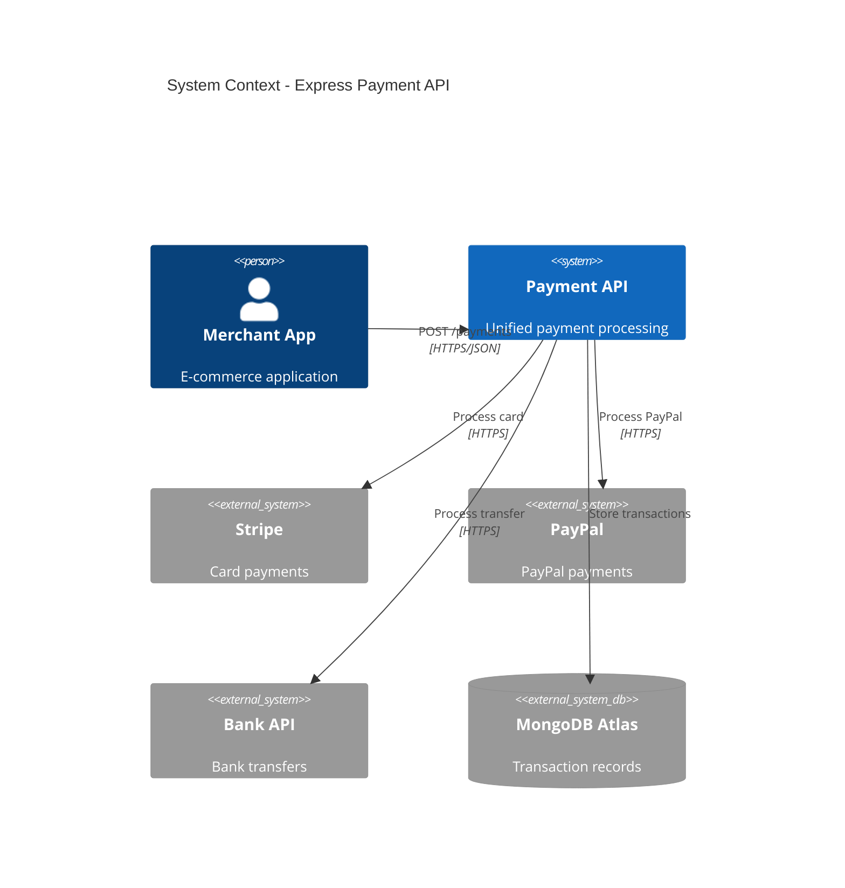
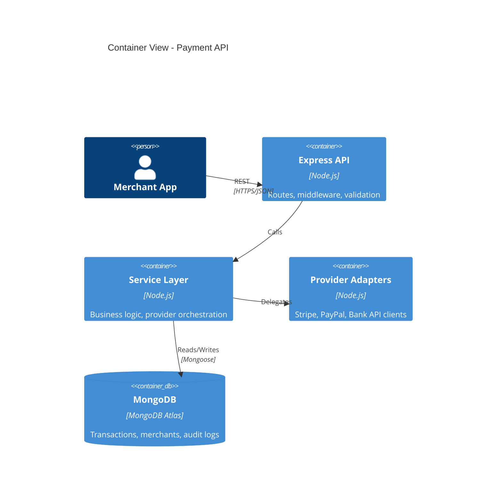
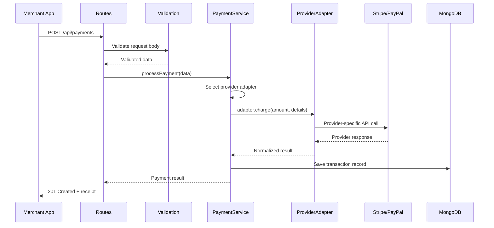
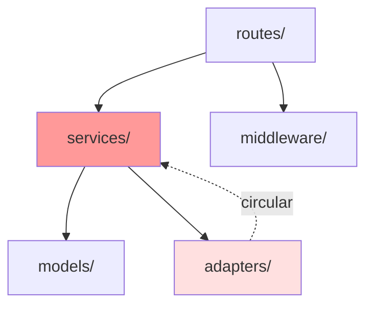

# Express Payment API

A REST API for processing multi-provider payments for small e-commerce merchants

*Walkthrough generated from 15-file codebase with 6 months of git history*

<!-- Presenter notes: This is a small but actively developed API. Single developer with 247 commits over 6 months. No ADRs found — all decisions are inferred from code structure. -->

---

## SECTION 1: THE STORY

---

## The Problem We Solve

Small e-commerce merchants need to accept payments from multiple providers (Stripe, PayPal, bank transfer) through a single unified API.

- **Users**: E-commerce merchants integrating via REST API
- **Pain point**: Each payment provider has a different API, authentication model, and webhook format
- **Before this system**: Merchants integrated with each provider separately, maintaining 3+ integrations

<!-- Presenter notes: No README or documentation explains the business context explicitly. This is inferred from route structure, provider adapters, and the README title "Payment Gateway API". -->

---

## System Context



---

## Key Numbers

| Metric | Value |
|--------|-------|
| **Files** | 15 (8 production, 4 test, 3 config) |
| **Language** | JavaScript (Node.js 18) |
| **Framework** | Express.js 4.18 |
| **Test Framework** | Jest with supertest |
| **Database** | MongoDB via Mongoose |
| **Age** | 6 months (first commit: 2025-08-12) |
| **Contributors** | 1 primary, 1 occasional |

---

## SECTION 2: THE ARCHITECTURE

---

## Container Overview



Three-layer architecture: Routes > Services > Models, with provider adapters as a separate concern.

---

## Decision: Express.js as Framework

*Inferred — no ADR found*

**Context**: The project needed a lightweight HTTP framework for a REST API. The team had prior Express experience (based on boilerplate patterns and middleware choices).

**Decision**: Chose Express.js 4.18 over alternatives (Fastify, Koa, NestJS).

**Consequences**:
- Familiar ecosystem with abundant middleware
- Mature and stable, but lacks built-in validation (added express-validator)
- No built-in TypeScript support (the project uses plain JavaScript)

**Evidence**: package.json dependencies, standard Express middleware stack (cors, helmet, morgan)
**Confidence**: High

---

## Decision: MongoDB for Persistence

*Inferred — no ADR found*

**Context**: The system stores transaction records, merchant configurations, and audit logs. Transactions have varying structures per payment provider.

**Decision**: Chose MongoDB (via Mongoose ODM) over a relational database.

**Consequences**:
- Flexible schema accommodates different provider response formats
- No migration management needed (schema-less)
- Loses ACID transactions across collections (mitigated by Mongoose transactions for critical paths)

**Evidence**: mongoose in package.json, `.model()` definitions with flexible `Mixed` type fields
**Confidence**: High

---

## Primary Data Flow



---

## SECTION 3: THE CODE

---

## Module Map



| Module | Files | Responsibility |
|--------|-------|---------------|
| `routes/` | 3 | HTTP endpoints, request/response handling |
| `services/` | 2 | Business logic, provider orchestration |
| `middleware/` | 2 | Auth, error handling, validation |
| `models/` | 3 | Mongoose schemas (Transaction, Merchant, AuditLog) |
| `adapters/` | 3 | Stripe, PayPal, Bank API clients |

---

## Hotspot: payment-service.js

**Hotspot score**: #1 (complexity: 47 branches, changes: 47 commits)

This is the system's core orchestration point. It:
- Selects the appropriate payment provider adapter
- Handles retry logic with exponential backoff
- Manages transaction state transitions (pending > processing > completed/failed)
- Logs audit events for every state change

**Risk**: Single 280-line file handling too many responsibilities. Candidate for decomposition into: provider selection, retry management, and state machine.

---

## Circular Dependency Alert

`services/payment-service.js` imports from `adapters/stripe-adapter.js`, which imports a utility function from `services/helpers.js`.

**Impact**: Makes both modules harder to test in isolation and creates fragile coupling.
**Suggestion**: Extract shared utilities to a separate `utils/` module.

---

## SECTION 4: THE QUALITY

---

## Test Strategy and Metrics

| Metric | Value | Assessment |
|--------|-------|------------|
| Test files | 4 | Covers routes and services |
| Test-to-code ratio | 0.5 | Below recommended (0.8-1.5) |
| Assertion density | 2.8/test | Healthy (threshold: >2.0) |
| Mock ratio | 1.5/test | Acceptable (threshold: <3.0) |
| Coverage | ~65% (estimated) | Moderate — adapters untested |

**Gap**: No integration tests for payment provider adapters. All external calls are mocked, meaning provider API changes would go undetected until production.

---

## SECTION 5: THE INFRASTRUCTURE

---

## Deployment

- **CI/CD**: GitHub Actions — lint, test, build on push
- **Hosting**: Deployed to Railway (detected from `railway.toml`)
- **Database**: MongoDB Atlas (connection string in environment variables)
- **Secrets**: Environment variables via `.env` (`.env.example` present)
- **No containerization**: No Dockerfile found

---

## SECTION 6: THE RISKS

---

## Risk Summary

| Risk | Severity | Details |
|------|----------|---------|
| **Single-author codebase** | High | Bus factor = 1. One developer wrote 95% of commits. |
| **Circular dependency** | Medium | services ↔ adapters coupling makes testing difficult |
| **No adapter tests** | Medium | Provider API changes undetected until production |
| **No monitoring** | Medium | No health checks, no error alerting, no metrics |
| **Payment service complexity** | Medium | 280-line file with 47 branches — high cognitive load |

---

## SECTION 7: GETTING STARTED

---

## Developer Setup

```bash
# Prerequisites: Node.js 18+, MongoDB (local or Atlas)
git clone <repo-url>
npm install
cp .env.example .env  # Configure MongoDB URI and provider API keys
npm run dev            # Starts on port 3000
npm test               # Run Jest test suite
```

**Key entry points**:
- `src/routes/payment-routes.js` — Start here to understand the API
- `src/services/payment-service.js` — Core business logic (the hotspot)
- `src/adapters/` — One file per payment provider

---

## Where to Get Help

- This walkthrough covers the system's structure and key decisions
- `README.md` in the repo root has basic setup instructions
- No ADRs or architecture docs exist — this walkthrough is the primary documentation
- The payment service file has inline comments explaining retry logic
